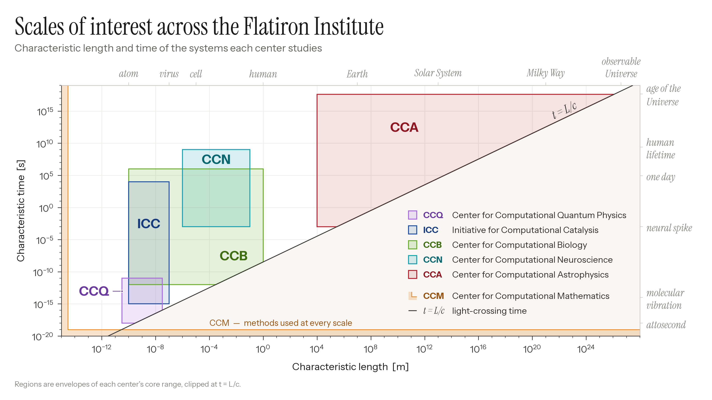

# Flatiron scale map

One figure, built from data: the characteristic **length** and **time** scales of the systems each
center at the [Flatiron Institute](https://www.simonsfoundation.org/flatiron/) studies, on a
log–log plane. Every region is clipped at the light-crossing line **t = L/c**.



Three clusters appear: atomic (quantum physics and catalysis), biological (biology and
neuroscience) and astrophysical. Quantum physics and catalysis overlap almost completely in
length and separate only in time, which is the reason for a 2D map rather than 1D bars.

---

## Quick start

Requires Python ≥ 3.11 (for `tomllib`).

```bash
pip install -r requirements.txt
python -m scalemap          # renders every layout to figures/ as PNG + PDF
python -m pytest            # geometry, data and rendering checks
```

Or with `make`: `make figures`, `make test`, `make clean`.

No installation step: run from the repository root. The fonts, data and figures are all in the repo.

## Outputs

| File (in `figures/`) | Aspect | For | Legend names |
|---|---|---|---|
| `flatiron_scale_map_16x9` | 16:9, 3200×1800 | slides | full ("Center for Computational Biology") |
| `flatiron_scale_map_3x2` | 3:2, 3060×2040 | web pages | short ("Biology") |
| `flatiron_scale_map_3x2_notitle` | 3:2 | papers (title and footnote go in the caption) | short |

Each comes as a PNG and as a vector PDF with fonts embedded. The 3:2 PDF scaled to a
double-column width (~7 in) gives ~8–9 pt text.

```bash
python -m scalemap slide              # one layout
python -m scalemap web paper -f pdf   # several, PDF only
python -m scalemap -f svg -o /tmp     # SVG, elsewhere
python -m scalemap slide --with-extensions   # add the edge cases (see below)
```

From Python:

```python
from scalemap import render
fig, diagnostics = render("web")
fig.savefig("scale_map.png", dpi=300)
```

## Repository layout

```
data/
  centers.toml       core length/time ranges, colors and provenance for each center
  landmarks.toml     reference objects and timescales printed on the top and right edges
  extensions.toml    edge cases outside the core ranges (not drawn by default)
scalemap/
  data.py            loading, validation, clipping to t >= L/c
  layouts.py         page sizes, margins, type sizes, label positions per layout
  plot.py            the renderer (Matplotlib, object-oriented API)
  fonts.py           registers the bundled fonts
  __main__.py        command-line interface
tests/               pytest suite: geometry against the reference vertices, data sanity, rendering
figures/             rendered outputs (committed)
fonts/               Instrument Sans and Instrument Serif, SIL Open Font License
docs/
  methodology.md     how each range was chosen, and what the figure does and doesn't claim
  design.md          palette, typography, layering and layout rules
```

## The data

The source of truth is [`data/centers.toml`](data/centers.toml). Each center has a core range:
a box in log₁₀(L / m) × log₁₀(t / s).

| Center | Length | Time | Set by |
|---|---|---|---|
| **CCQ**, Quantum Physics | 0.3 Å – 30 nm | 1 as – 10 ps | electron orbitals → moiré superlattices; attosecond dynamics → ps relaxation |
| **ICC**, Catalysis | 1 Å – 100 nm | 1 fs – 3 h | bonds and active sites → nanoparticles and interfaces; vibrations → turnover and deactivation |
| **CCB**, Biology | 1 Å – 1 m | 1 ps – 12 d | atoms in cryo-EM and designed proteins → vascular networks; protein motion → embryonic development |
| **CCN**, Neuroscience | 1 µm – 10 cm | 1 ms – 30 yr | synapses → whole brain; spikes → learning, development and aging |
| **CCA**, Astrophysics | 10 km – 4×10²⁶ m | 1 ms – 13 Gyr | neutron stars → observable Universe; ms spin and mergers → Hubble time |
| **CCM**, Mathematics | all scales | all scales | builds methods used by every center, so it is drawn as an L-shaped band along both axes, not a region |

The bounds are judgment calls about each center's *core* program, made from the centers' public
pages. They are not official Flatiron numbers. [`docs/methodology.md`](docs/methodology.md) gives
the reasoning for every bound.

### How a region is built

1. Take the core box `[L_min, L_max] × [t_min, t_max]`.
2. Clip it to the causal half-plane `t ≥ L/c`, which in log space is `y ≥ x − log₁₀ c` with
   `log₁₀ c = 8.4768`. A system whose dynamics are faster than light can cross it has no coherent
   system-scale behavior, so that half of the plane is empty. It is drawn as a flat gray field.
3. Draw washes from the largest area to the smallest, then all outlines on top.

Only CCQ, CCB and CCA are actually clipped. `tests/test_geometry.py` checks the computed polygons
against the reference vertices the figure was first specified with.

## Editing

**Change a range.** Edit `length` or `time` in `data/centers.toml` and run `python -m scalemap`.
`test_regions_match_reference` will then fail by design. Update `REFERENCE` in
`tests/test_geometry.py` once the new range is the intended one.

**Change a color.** Edit `color`, `label_color` and `wash_alpha` for that center. Keep
`label_color` a darker shade of `color`, and lower `wash_alpha` for darker hues so all washes land
at the same lightness (see [`docs/design.md`](docs/design.md)).

**Add a center.** Add a `[[center]]` table in scale order, then give its label a position in the
`labels` dict of each layout in `scalemap/layouts.py` (data coordinates: log₁₀ m, log₁₀ s). The
legend picks it up automatically.

**Add or tune a layout.** Copy a dict in `scalemap/layouts.py`, change it, and register it in
`LAYOUTS`. The legend measures its own text and right-aligns itself. `render()` reports
`legend_clear = False`, and the tests fail, if it would cross the t = L/c line.

**Edge cases.** `data/extensions.toml` keeps systems that some groups study outside the core
ranges: cavity-coupled materials (CCQ), behavior and natural scenes (CCN), kinetic plasma scales
(CCA). `--with-extensions` draws them as dashed outlines. Region labels are not re-placed in that
mode, so check for overlaps.

## Design in brief

White page; the excluded half below t = L/c is a quiet warm gray, so the diagonal carries the
composition. Each center owns one hue, used three ways: a pale wash, a full-strength outline and a
darker shade for its label. Labels sit directly in their regions, so the legend is a reference,
not something you need to decode the plot. Instrument Serif sets the title and the italic
reference landmarks; Instrument Sans sets the data. One minor tick per decade on both axes. Details,
including color-vision caveats, are in [`docs/design.md`](docs/design.md).

## License

- Code (`scalemap/`, `tests/`): MIT, see [`LICENSE`](LICENSE).
- Data and figures (`data/`, `figures/`, `docs/`): CC BY 4.0, see [`LICENSE-DATA`](LICENSE-DATA).
- Fonts (`fonts/`): SIL Open Font License 1.1, see the `OFL-*.txt` files there.

Citation metadata is in [`CITATION.cff`](CITATION.cff).
